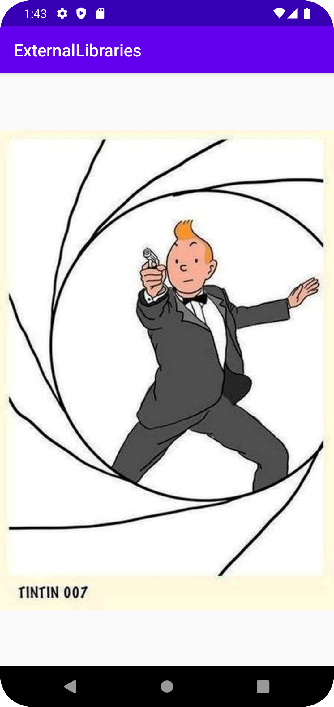

# Rapport

**External Libraries**

Denna uppgift gick ut på att lägga till och använda en external librarie.

Det extärna bibliotekt som användes för denna inlämninga är Glide.
Glide hjälper till med att hämta bilder från intenet.

För att appen skule kunna hita Glide behövde det läggas till mavenCentral() som 
ett repositorie i build.gradle (externalLibraries).

För att sen kunna få Glide att fungera i programet så behövdes 
två dependencies läggas till.
```
implementation 'com.github.bumptech.glide:glide:4.16.0'
annotationProcessor 'com.github.bumptech.glide:compiler:4.7.1'
```

Till activity_main.xml skapades en imaged view.
I MainActivity.java lades det till så glide sätter en bild från internet på 
imaged taggen.
```
Glide.with(this).load("https://i.pinimg.com/736x/e5/5e/0a/e55e0a30fe66a81b6d7adc1cd9df252e.jpg").into(URLView);
```

Bild på hur det ser ut i appen


